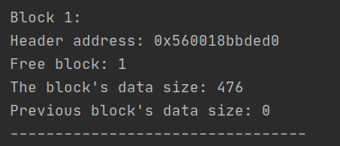
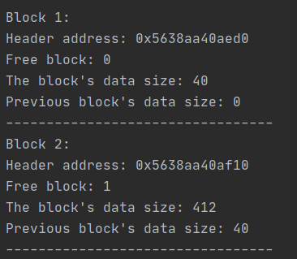
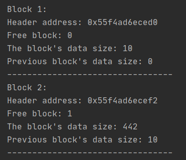
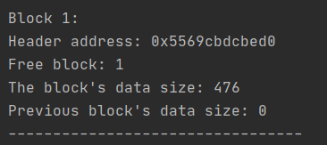

#Memory Allocator

###Lab1 - C++ implementation of memory allocator

The main idea of this lab is to manage efficiently the memory
the allocator. Allocator contains blocks of memory, each of them contains
header for metadata and actually block of data 

##Header structure
1.  `size_t data_size` -  the size of data block (8 byte)
2. `size_t prev_data_size` - the size of data, that contain in previous memory block (8 byte)
3. `bool is_block_free` - checks is the current data block is occupied by some data. (8 byte - because
bool variable in structure aligns to the biggest variable (size_t in our case)) 

Total Header size = 24 bytes

##Main functions
`void* mem_alloc(size_t size)` - the function searches in allocator for the suitable place to insert memory block. Returns `nullptr`
if the place wasn't found else returns the data address of inserted block.

`void* mem_realloc(void* addr, size_t size)` - the function increases or decreases data size in the block where data block has adress `addr` and size `size`
If `size` is less or equal than data size, then the 
function `split_block(void* header_addr, size_t first_block_data_size)` is called, which split the block on 2 blocks, first block will be occupied by data from the old block 
and the second block will be free, then the function `mem_free(addr)`  will free the the second block.

`void mem_free(void* data_addr)` - the function searches the block with data address `data_addr` and frees this block,
makes it available for the next operations of memory allocation.

`void mem_dump()` - the function does 'screenshot' of the allocator, showing every block and its state.

##Usage

#####Creating allocator with 500 bytes (creating one block of memory):

```
Allocator* a = new Allocator(500);
a->mem_dump();
```



#####Allocate 40 bytes in the allocator:
```
Allocator* a = new Allocator(500);
auto addr1 = a->mem_alloc(40);
a->mem_dump();
```


#####Reallocate 40 bytes to 10 bytes:
```
Allocator* a = new Allocator(500);
auto addr1 = a->mem_alloc(40);
a->mem_realloc(addr1, 10);
a->mem_dump();
```


#####Free first block in allocator:
```
Allocator* a = new Allocator(500);
auto addr1 = a->mem_alloc(40);
a->mem_realloc(addr1, 10);
a->mem_dump();
```


Inserting the string with `mem_free` code: 

```
Allocator* a = new Allocator(500);
auto addr1 = a->mem_alloc(40);
auto addr2 = a->mem_realloc(addr1, 10);
a->mem_free(addr2);
a->mem_dump();
```
 
