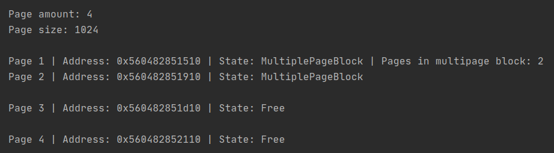
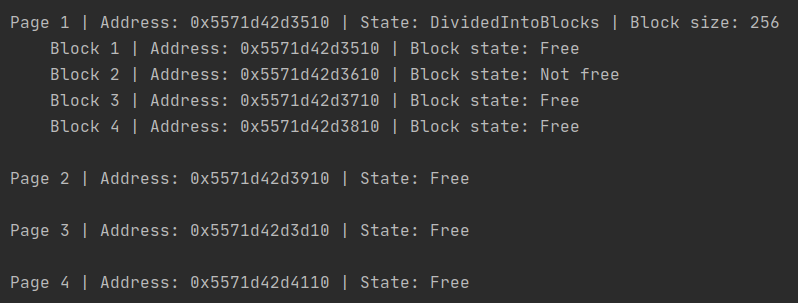

#Page Allocator

This is an implementation of memory allocator based on pages. 

##Description
Each page is presented by its descriptor that contains info about page's state
(free, divided into blocks or a part of multipage block), pointer to the page start in memory,
a list of free blocks and block size(for divided into blocks pages), 
page amount (for multipage block)

Allocator contains a list of page descriptors, a pointer to the memory area and
overall amount of pages.

Every page contains blocks of only same size. Every block's size is the power of 2 and 
maximum block size is half a page size (512 bytes). In this implementation minimal block size is 16 bytes 
and the page size is 1024 bytes.

##Main functions: 
* `void* mem_alloc(size_t size)` - allocate block memory of `size` bytes.

If size less or equal than half of page size then the page can be only divided into blocks or
can be a part of multipage block. If we can find free block in the divided page, we'll occupy this block
otherwise allocator will divide new free page into blocks and occupy first of them.
In this case function will return the address of new occupied block.

If size greater than half of page size then the allocator will find the necessary amount of pages to cover the
`size` and will create multipage block and then return the first page address of multipage block.

If allocation is not possible then the function returns `nullptr`.

* `void mem_free(void* addr)` - free the occupied block of page if page is divided into blocks or 
free the multipage block is addr is the start of this block.

In case of block deoccupation the function will free the block, add the block to the page list of free blocks
In case of multipage block deoccupation the function will free every page in block, makes it initially free and sets the page state as free.

* `void* mem_realloc(void* addr, size_t size)` - reallocate the block at `addr` adress to the new size.
Indeed it is just a sequence of `mem_free(addr)` and `mem_alloc(size)`invokes.

* `void mem_dump()` - represent the current allocator's state.

##Tests

Allocate the size less than half of page

Allocate the size greater than half of page

Reallocate the size to the bigger value

Reallocate the size to the smaller value

Free the multipage block

Free block in the divided page

 

