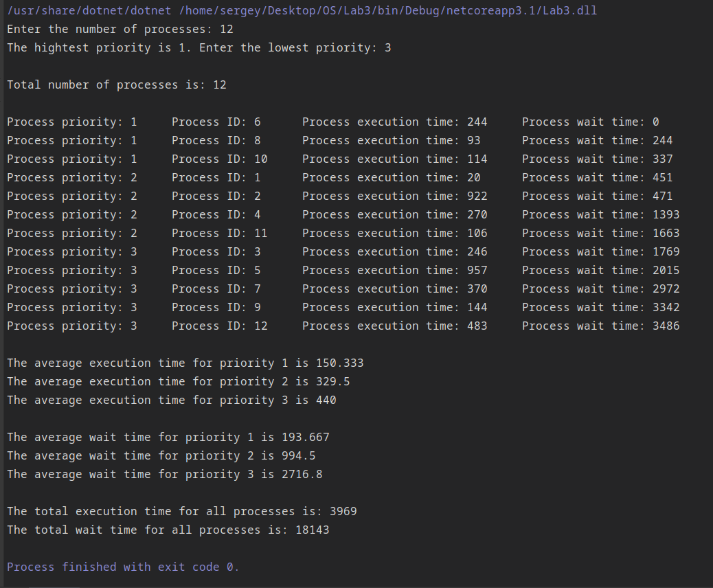
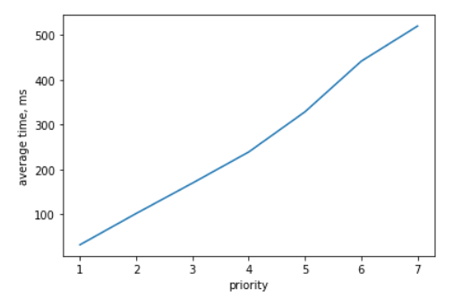
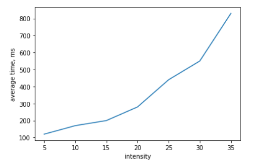

# Lab3 - Process Scheduler Simulator

##### The purpose of the Lab3 is to create the process scheduler simulator that can organise different processes into the order for executing by system.

My variant is 7 so I've created the Process Scheduler Simulator based on 
**algorithm PQ (Priority Queuing)**.

## Process structure:
##### 1) Process ID
##### 2) Priority (1 - the highest priority, >1 - lower priority)
##### 3) Execution time (in ms)
##### 4) Wait time - time that process should wait in the queue. Equals the sum of execution and wait times of the previous block, the wait time for the first process is 0, that is it's ready for executing.

All processes order in queue by priority (first condition) and id (second condition) ascending.
In my simulator the maximal execution time for each process is 1 second (1000 ms).
There are also some statistical properties such as the total execution and wait times for all processes and
execution and wait times for each priority.

## Main functions

1) ProcessScheduler() - constructor, which creates `NumberOfProcesses` processes
and adds them into priority queue via the function `AddToPriorityProcessList`

2) void AddToPriorityProcessList(Process p) - the function takes the process and puts in the necessary place in queue.
After each process insertion we should use `RecalculateProcessesWaitTimeFromIndex` function to update the wait times for processes

3) void RecalculateProcessesWaitTimeFromIndex(int index) - the function recalculates the wait times in the process queue beginning with the process with index `index`

## Test 

## Graphics

1) Dependence of the average process waiting time on the priority

2) Dependence of the average process waiting time on the process intensity

