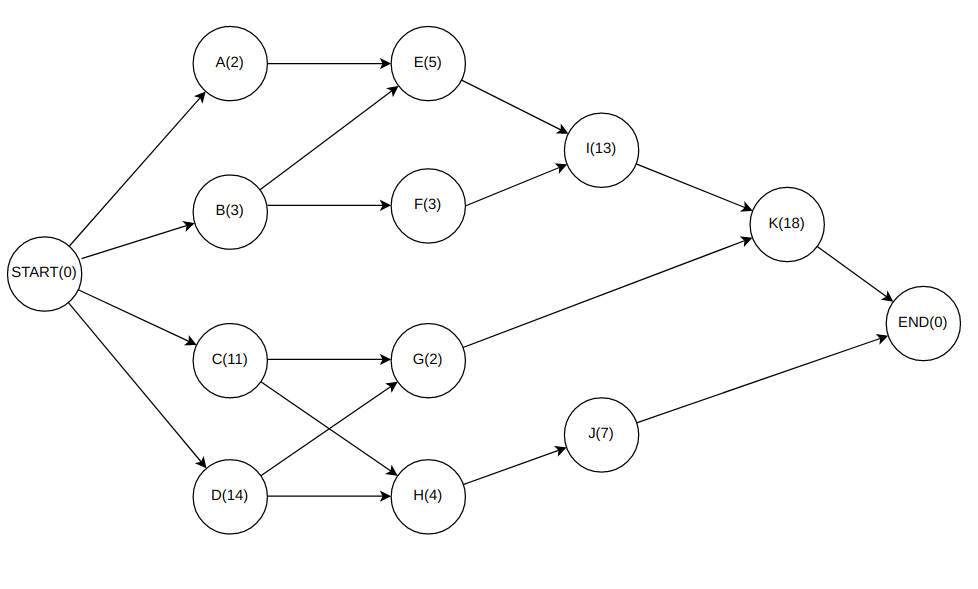
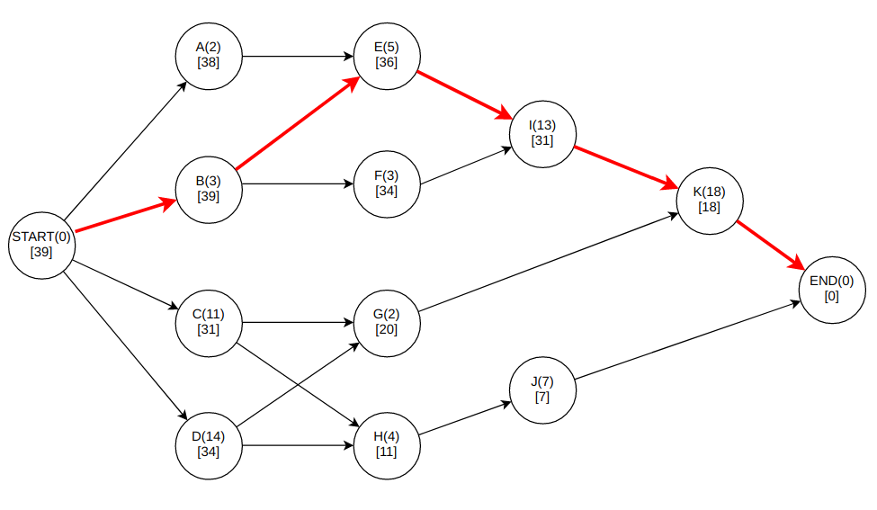
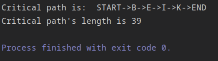

# Lab4 - Dynamic Process Scheduling

My variant is 9 - finding the critical path in the weighted, acyclic, directed graph of processes.

### Theory and algorithms' descriptions
Critical path in graph is the longest path between the vertice and the end vertice.
The length of this path is called critical time. Each vertice has its own critical time and, of course,
the start vertice has the biggest critical time. This time equals to the minimal time, that needs to be by for computational
system to execute all processes.

Each vertice represents distinct process, which consists of its title, execution time and critical time.

The finding of the critical path in graph is divided into two parts:
1) Finding the critical times for each vertice - function `void CalculateCriticalTimes()`
Starting from the end vertice and ending with the start vertice, function uses breadth-first-search to traverse the graph
and sets the critical times by comparing the sum of the execution time of the previous vertice and the critical time of the current vertice with the critical time of the 
previous vertice. If this sum is bigger then it's assigned to the previous vertice's critical time.

2) Finding the critical path - function `List<Process> CalculateCriticalPath()`
This function starts from the start vertice and goes to the end vertice, searching for the vertice which has the critical time that 
equals to the subtraction of execution and critical times of the previous vertice. Then this vertice is added to the path list and function does all these steps, considering this vertice as a new start vertice.

There is also a print function `void PrintCriticalPathInfo()` which prints the critical path from the start vertice and its length
I represent the graph to the program via the adjacency matrix.

#### Graph before calculating critical times:

#### Graph after using applying functions of calculating critical times and path:

#### Program output:
