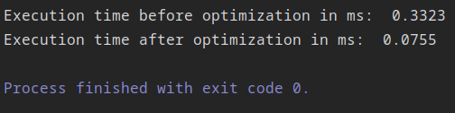

## Lab5 - Memory Work Optimization

The task is to measure the execution time of the following code snippet and then 
modify it so that the execution time would be less than previous measure time

### Code snippet

	static void Main(string[] args)
    {
        int[,] b = new int[100,100];
        int res = 0;

        for (int j = 0; j < 100; j++)
        {
            for (int k = 0; k < 100; k++)
            {
                b[k, j]++;
            }
        }
    }  

The main optimization is to traverse the matrix by rows, not columns. The reason 
is in space locality: the matrix is stored per row in memory, so it's much quicker to get the next row 
from memory than to spend some time before that for searching the appropriate column.

### Optimization results

As you can see, the program executes faster approximately in 5 times.

 
       