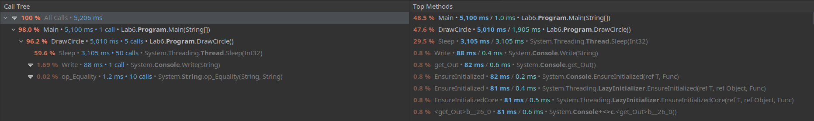
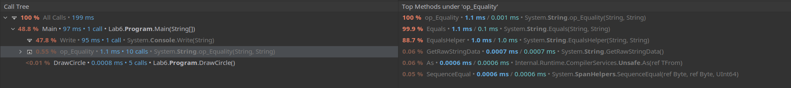

### Lab 6 - Program profiling

In this lab we should explore the basics of profiling theory and apply them for 
checking the program execution time optimization. So we should check the execution time before and after 
optimization with the help of profiling, that can be manual of automatic. I will use the integrated into Rider 
profiling tool "Perfomance Profiler", which helps to see results of optimization.

### Code snippet for optimization

        static void DrawCircle()
        {
            for (int i = 0; i < 10; i++)
            {
                Thread.Sleep(100);
            }
        }

        static void DrawSquare()
        {
            for (int i = 0; i < 10; i++)
            {
                Thread.Sleep(100);
            }
        }
        
        static void Main(string[] args)
        {
            Console.Write("\nInside main\n");
            string typeOfShape = "circle";
            int i = 0;
            for (i = 0; i < 5; i++)
            {
                switch (typeOfShape)
                {
                    case "square":
                        DrawSquare();
                        break;
                    case "circle":
                        DrawCircle();
                        break;
                }
            }
        }
        
### Performance tests

As we can see the code optimization allows decrease the execution 
time of program in ~20 times.
